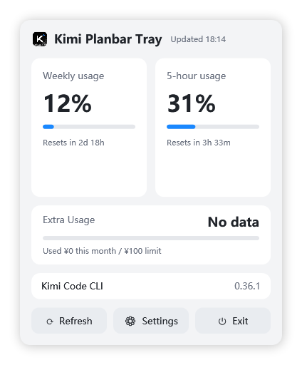
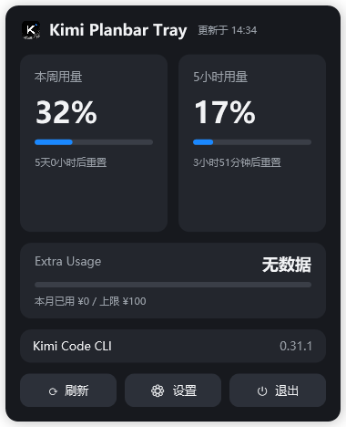

# Kimi Planbar Tray

[English](README.md)

一个轻量的 Windows 托盘程序，让 [Kimi Code](https://www.kimi.com/code/) 套餐额度随手可查——5 小时窗口和每周用量，带重置倒计时，就在系统托盘里。

| Moonlit（亮面） | Moondark（暗面） |
|---|---|
|  |  |

## 功能

- **托盘常驻**——左键图标弹出悬浮窗（Windows 原生滑出动画），失焦自动隐藏；右键菜单：Open / Refresh / Settings / Skills / Exit
- **额度一目了然**——5-hour 与 Weekly usage 双卡片，进度条 + 重置倒计时；数据与 CLI 的 `/usage` 同源
- **亮暗双主题**——Moonlit / Moondark，可跟随 Windows 系统主题实时切换（也可在设置里固定）；强调色 `#1A88FF`
- **抗抖动刷新**——按设定间隔自动刷新（1/5/10/30 分钟）；失败时保留上一次成功的数据，30 秒后快速重试
- **CLI 版本检测**——显示本机 `kimi --version`；[kimi-code Releases](https://github.com/MoonshotAI/kimi-code/releases) 有新版时出现橙色徽章（点击版本行直达发布页）。版本信息优先取自官方 changelog（GitHub API 兜底），GitHub 不可达也能正常工作
- **悬停即新**——鼠标悬停托盘图标时后台预取额度（10 秒节流），tooltip 和悬浮窗永远显示最新数字
- **Extra Usage 卡片**——显示 booster 钱包余额（¥）与本月已用/上限；未充值过时优雅显示 "Not activated / No data"
- **Skills 速览**（Rust 版）——右键菜单 → Skills 打开只读列表：按来源分组展示 `~/.kimi-code/skills`、`~/.agents/skills` 与插件 skills 的名称和描述；只在打开窗口时扫描一次并缓存，无后台轮询
- **绿色免 UAC**——单 exe，仅操作用户域（自启走 HKCU，不碰 HKLM 和 Program Files）；在 exe 旁放一个空的 `portable.dat` 即切换为配置随身携带的便携模式
- **占用小**——单文件版 ~260 KB，运行内存 ~80 MB，除刷新定时器外无任何后台轮询

## 下载

> **WPF 版已停止维护**（停留在 v1.5.0）——新功能只进 Rust 版，`wpf/` 源码保留仅供参考。

从 [Releases](../../releases) 获取最新 exe：

| 版本 | 体积 | 前提 | 内存占用（实测） |
|---|---|---|---|
| `KimiPlanbarTray-rust.exe` | ~5.6 MB | 无——使用系统自带 WebView2 | ~317 MB |
| `KimiPlanbarTray-wpf.exe`（已停维护） | ~260 KB | 已安装 [.NET 8 桌面运行时](https://dotnet.microsoft.com/download/dotnet/8.0) | ~69 MB |
| `KimiPlanbarTray-wpf-selfcontained.exe`（已停维护） | ~65 MB | 无——运行时已打包在内 | ~69 MB |

两个版本 UI/UX 完全一致（见 `docs/SPEC.md`），共用同一份设置文件。

> exe 未做代码签名，首次运行 Windows SmartScreen 可能提示"已保护你的电脑"——点"更多信息 → 仍要运行"即可，这是未签名个人作品的正常提示。

## 使用前提

- Windows 10 / 11
- 已安装并登录 [Kimi Code](https://www.kimi.com/code/) CLI，且为 **Kimi For Coding** 套餐用户（程序从 `~/.kimi-code/credentials/kimi-code.json` 读取 CLI 的本地 OAuth token，兜底读 `~/.kimi-code/config.toml` 里的明文 api_key）
- 能访问 `api.kimi.com`

凭证不会被存储或发送到官方 `api.kimi.com/coding/v1/usages` 接口以外的任何地方。

## 使用说明

- **左键托盘图标**——显示 / 隐藏悬浮窗
- **右键托盘图标**——菜单：Open / Refresh / Settings / Skills / Exit
- **悬停托盘图标**——速览 `5h X% · week Y%`
- **设置**——主题（System default / Moonlit / Moondark）、刷新间隔、开机自启
- **Console 按钮**——在浏览器中打开 [Kimi Code 控制台](https://www.kimi.com/code/console)
- **版本行**——点击打开 Releases 页面

## 从源码构建

本仓库包含两个版本：`wpf/`（原版 .NET 8 / WPF，**自 v1.6.0 起停止维护**，保留仅供参考）和 `rust/`（Tauri 2 / Rust 重写版，活跃开发中）。共享 UI/UX 规格见 `docs/SPEC.md`。

WPF 版（已停维护）——需要 .NET 8 SDK（Windows）：

```bash
cd wpf
dotnet publish -c Release -r win-x64 --self-contained false -p:PublishSingleFile=true -o publish
# 自包含版：
dotnet publish -c Release -r win-x64 --self-contained true -p:PublishSingleFile=true -p:EnableCompressionInSingleFile=true -o publish-sc
```

Rust 版——需要 Rust（stable，MSVC）、Node.js 18+ 和 WebView2 Runtime：

```bash
cd rust
npm install
npx tauri build   # 单文件 exe 产出于 src-tauri/target/release/
```

无头自检（适合 CI 或改动后验证）：

```bash
KimiPlanbarTray.exe --test-fetch   # 拉取一次额度，打印 JSON 后退出
KimiPlanbarTray.exe --test-ui      # 构造全部 4 个窗口，打印 OK 后退出（约 6 秒）
```

## 技术说明

- Rust 版：Tauri 2 后端 + vanilla HTML/CSS/TS 前端（无框架）；WPF 版（已冻结）：.NET 8 / WPF，零第三方 NuGet 依赖
- UI 设计与布局改编自 [KimiCodeBar](https://github.com/xifandev/KimiCodeBar)（MIT），作者 [@xifandev](https://github.com/xifandev)
- 额度逻辑移植自 [kimi-planbar](https://github.com/baigong-ai/kimi-planbar)（MIT）——token 来源、接口与缓存/重试策略一致
- 托盘图标为内嵌的官方 Kimi Code logo（PNG 压缩 ICO）；logo 版权归 **Moonshot AI** 所有——本项目为非官方社区工具，与 Moonshot AI 无隶属关系

## License

[MIT](LICENSE) © 2026 Shawn Qi (shawn-0106t)，部分内容 © baigong-ai (kimi-planbar)，© xifandev (KimiCodeBar)
